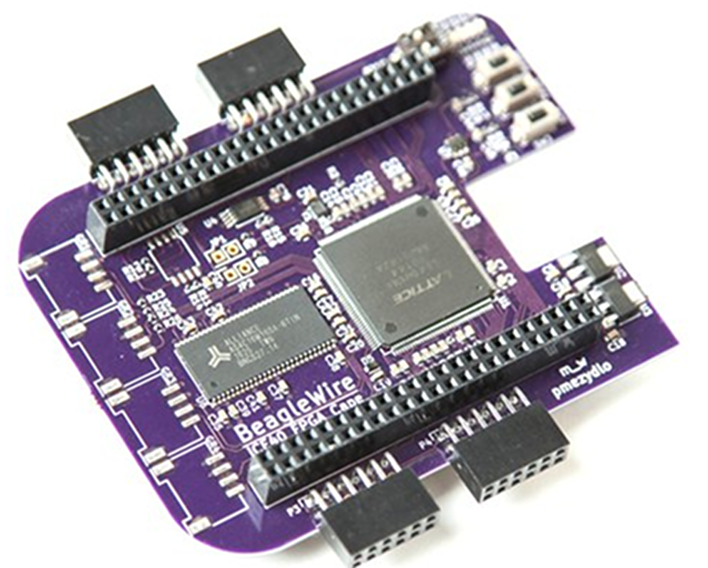
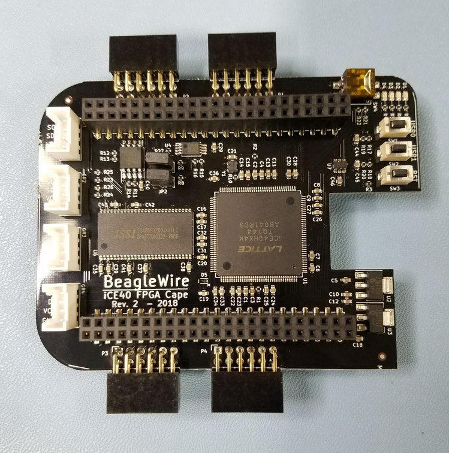

Branch|
---|--- 
master|
develop|

## Introduction
This repository contains software for BeagleWire. It is a realization of my project for GSOC-2017.
The task is to create software support for BeagleWire (based on iCE40 device). The completed project will provide the BeagleBoard.org community with easy to implement and powerful tools for realization of projects based on Programmable Logic Device(FPGA), which will surely increase the number of applications based on it. The developed software will be an easy and, at the same time, efficient tool for communication with FPGA. At this point FPGA will be able to meet the requirements of even more advanced applications. The BeagleWire creates a powerful and versatile digital cape for users to create their imaginative digital designs. 

## About BeagleWire cape
The BeagleWire is an FPGA development platform that has been designed for use with BeagleBone boards. BeagleWire is a cape on which there is an FPGA device - Lattice iCE40HX. The Lattice iCE40 is a family of FPGAs with a minimalistic architecture and very regular structure, designed for low-cost, high-volume consumer and system applications. The significance of FPGAs is continuously increasing, as they are more and more often used to support ARM processors. BeagleWire does not require external tools (JTAG) and the whole software is Open Source. iCE40 is an energy saving device, allowing to work with small batteries. FPGA cape allows easy and low cost start for beginners who would like to take their first steps in working with FPGAs. The developed software will be an easy and, at the same time, efficient tool for communication with FPGA. At this point FPGA will be able to meet the requirements of even more advanced applications. The BeagleWire creates a powerful and versatile digital cape for users to create their imaginative digital designs.

BeagleWire features:
 * FPGA: Lattice iCE40HX4K - TQFP 144 Package
 * GPMC port access from the BeagleBone
 * SPI programming port from the BeagleBone
 * 4 layer PCB optimized design to support maximum performance for high bandwidth applications
 * BeagleBoard optimized - compatible with BeagleBone Black, BeagleBone Black Wireless, element14 BeagleBone Black Industrial
 * does not require external tools (JTAG)
 * minimalistic architecture and very regular structure
 * energy saving device allows to work with small batteries
 * lower application costs
 * fully open-source toolchain

BeagleWire Peripherals:
 * 32 MB SDRAM
 * 100Mhz external clock
 * 4 LEDs
 * 4 PMOD connectors
 * 4 Grove connectors
 * 2 user push buttons
 * 2 input DIP switch

## Resources
<a href="https://hackaday.io/project/20989-beaglewire">Hackaday project page</a> 
<a href="https://github.com/mwelling/beagle-wire">BeagleWire KiCAD Repository</a>
<a href="https://www.hackster.io/46021/beaglewire-566292">Hackster.io project page</a> 
<a href="https://github.com/mwelling/beagle-wire/blob/master/plots/beagle-wire.pdf">BeagleWire Schematic</a> 
<a href="https://elinux.org/BeagleBoard/BeagleWire">Quick Start Guide</a> 
<a href="https://www.crowdsupply.com/qwerty-embedded-design/beaglewire">Buy at CrowdSupply</a> 

## Development status

## Authors && Contributors
The project is the result of the community work and it is still under development. If you can support this project or if you have any questions, feel free to contact us.

 * [Patryk Mężydło](https://github.com/pmezydlo)
 * [Trammell Hudson](https://github.com/osresearch)
 * [Michael Welling](https://github.com/mwelling)

## Images
 * R0
  

 * R2
  

## License
Licensed under [GPL 2.0](http://opensource.org/licenses/GPL-2.0)
